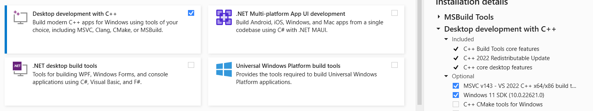

# Chương trình tự động tạo PPTX (từ video bài giảng PPTX)
- Chương trình sẽ tách tất cả các frame của video ra, 
tìm kiếm các frame ppt giữa của các lần chuyển động, tìm mỗi trang ppt 1 ảnh
tạo file ảnh từ các trang đó.

- chúng ta có thể xóa ảnh thừa ở thư mục Output1

- tạo file pptx theo template ở file  `taTemplate.pptx` đi kèm. Có thể thay thế, chỉnh sửa template của file này để có kết quả phù hợp.

## Cách dùng
### Chuẩn bị

- File video bài giảng PPT (nó ít chuyển động thừa, chỉ ppt và giảng thôi thì phù hợp)
- Sửa file video input
- Sửa các bước cần làm trong RUN
- Chạy file `main1.py`
- Sửa file pptx output (tự mở sau khi hoàn thiện)

# Cách build file .pyd cho python
 ## install 
  - `pip install cython`
  - Install visual studio (MSVC... và Windows ... SDK): 
  - 
## Run:
  - cd to the file.
  - `cythonize -i taTest.py`
  - 
